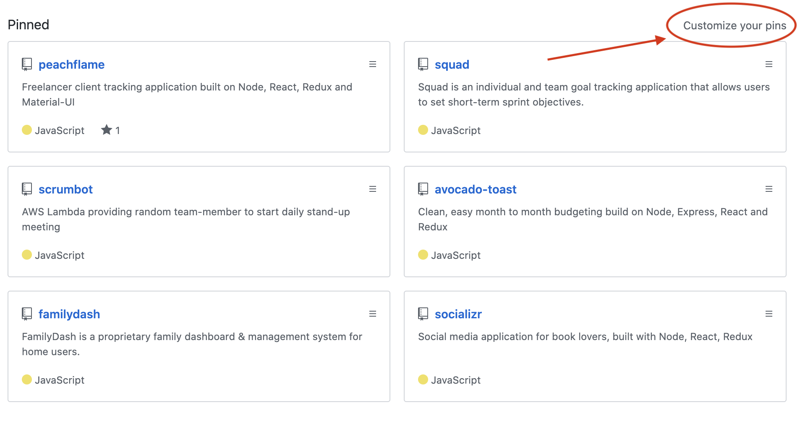
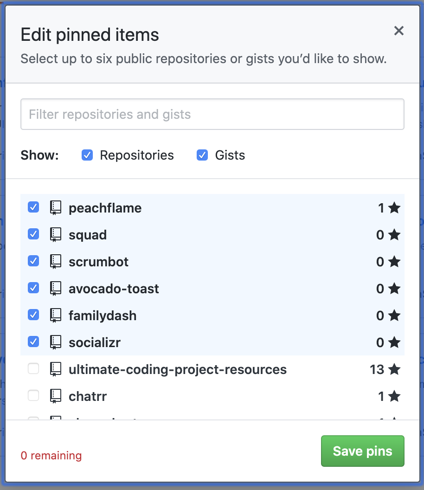

#### Instructor Do: Introduction to READMEs (5 min)

- Ask the class the following questions (☝️) and call on students for the answers (🙋):

  - ☝️What is a README file?

  - 🙋A text file written using Markdown that describes the repository, what it does, how to use it, who built it, etc.

  - ☝️ Why are they important?

  - 🙋 It is the first impression recruiters and prospective employers will have of our resume.

  - ☝️And what should we include in order to make it a good, high-quality README that we would want employers to see?

  - 🙋A README should include a a project title, the technology used, screen shots, installation instructions, instructions on how to use it, tests, any credits you need to give, as well as contributors.

- Show students how to pin a repository in GitHub. Navigate to `www.github.com/<yourUsername>` and click `Customize your pins`:

- Then select the pins you would like to show on the main page of your profile:

- Let students know this allows recruiters to more easily find the repositories you want them to look at!

#### Students Do: Compare and Review (10 min)

- In this activity, students will compare three README files and write down the differences they note between them.

- Ask students to compare `SAMPLE_1.md`, `SAMPLE_2.md` and `SAMPLE_3.md` and note the differences they see.

#### Instructor Do: Review ReadMe (5 min)

- Ask the class the following questions (☝️) and call on students for the answers (🙋):

- Pull up `SAMPLE_1.md` to show to students.

  - ☝️ What did we think of this README?

  - 🙋 Terrible!
    - No creative title
    - No subsections containing relevant data
    - The developer refers to themself as "me"
    - No images

- Pull up `SAMPLE_2.md` and `SAMPLE_3.md` to compare.

  - ☝️ Which of the two do we prefer?

  - 🙋 Number 3!

  - ☝️ OK, and why?

  - 🙋 It's better because it has a unique app title and subsections but:
    - The images are broken
    - No installation instructions
    - No license
    - No LinkedIn

#### Students Do: Create Readme (15 min)

- For the remaining 15 minutes, askstudents to select one repository from their GitHub and create a new README for it that meets the standards set in `SAMPLE_3.md`. They should feel free to add other elements that they think will be useful for people to know about their project.
